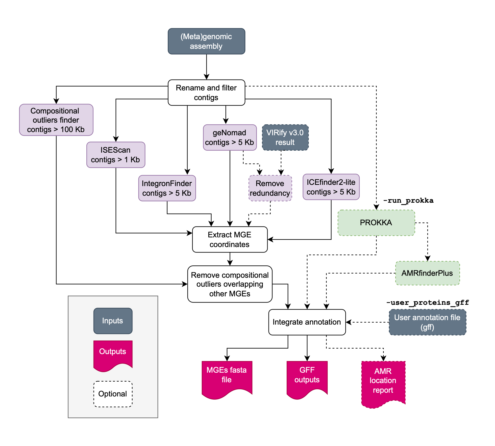

[](https://github.com/EBI-Metagenomics/mobilome-annotation-pipeline/actions/workflows/test_modules.yml)

# Mobilome Annotation Pipeline (former MoMofy)

<p align="center" width="100%">
   
</p>

Bacteria can acquire genetic material through horizontal gene transfer, allowing them to rapidly adapt to changing environmental conditions. These mobile genetic elements can be classified into three main categories: plasmids, phages, and integrative elements. Plasmids are mostly extrachromosmal; phages can be found extrachromosmal or as temperate phages (prophages); whereas integrons are stable inserted in the chromosome. Autonomous elements are those integrative elements capable of excising themselves from the chromosome and reintegrate elsewhere. They can use a transposase (like insertion sequences and transposons) or an integrase/excisionase (like ICEs and IMEs).

The Mobilome Annotation Pipeline is a wrapper that integrates the output of different tools designed for the prediction of plasmids, phages, insertion sequences, integrative mobile genetic elements such as ICEs, IMEs, integrons, and non-autonomous mobile genetic elements in prokaryotic genomes and metagenomes. The output is a GFF3 file with the mobilome annotation.

## Contents

- [ Workflow ](#wf)
- [ Install and dependencies ](#install)
- [ Usage ](#usage)
- [ Inputs ](#in)
- [ Outputs ](#out)
- [ Tests ](#test)
- [ Citation ](#cite)

<a name="wf"></a>

## Workflow

<p align="center" width="100%">
   
</p>

This workflow has the following main blocks of analysis:

- Preprocessing: Rename and filter contigs.
- Prediction: Run geNomad, ICEfinder2-lite, IntegronFinder, ISEScan, and a compositional outliers detection module (on contigs > 100kb).
- Genes annotation: Generate extra-annotation for antimicrobial resistance genes (AMRFinderPlus, only with `-run_prokka` or `-user_gff` options).
- Integration: Parse and integrate. In this step optional results of VIRify v3.0.0 can be incorporated. MGEs <500 bp lengh and predictions with no genes are discarded.
- Postprocessing: Write the mobilome gff file (`mobilome.gff`), the mobilome fasta file (`mobilome.fasta`), and write a report of the location of AMR genes either mobilome or chromosome (when `-run_prokka` option is activated). When `user_gff` is provided or `-run_prokka` is set to True, three more GFF files will be generated:

1. `mobilome_clean.gff`: mobilome + MGEs associated CDSs
2. `mobilome_extra.gff`: mobilome + ViPhOGs/mobileOG annotated genes (note that ViPhOG annotation is generated by VIRify)
3. `mobilome_full.gff`: mobilome + any other annotation on user gff file or in PROKKA gff file

The output `mobilome.gff` is validated as part of the postprocesing.


<a name="install"></a>

## Install dependencies and databases downloading

This workflow is built using [Nextflow](https://www.nextflow.io/). It uses docker/singularity containers making installation trivial and results highly reproducible.

- Install [Nextflow version >=21.10](https://www.nextflow.io/docs/latest/getstarted.html#installation)
- Install [Singularity](https://github.com/apptainer/singularity/blob/master/INSTALL.md)


To get a copy of the Mobilome Annotation Pipeline, clone this repo by:

```bash
$ git clone https://github.com/EBI-Metagenomics/mobilome-annotation-pipeline.git
```

The first time you run the pipeline, activate the databases downloader using the flag `-download_dbs`. Databases will be downloaded in the current directory. Once donwloading is complete, you can move the files to any suitable location. We recomment to create a config file with the following paths and pass it to the pipeline during execution using `-c my_paths.config`

`my_paths.config`
```bash
/*
    ~~~~~~~~~~~~~~~~~~~~~~~~~~~~~~~~~~~~~~~~~~~~~
     Config to store my DB paths and names
    ~~~~~~~~~~~~~~~~~~~~~~~~~~~~~~~~~~~~~~~~~~~~~
*/

params {
    amrfinder_plus_db    = "/FULL/PATH/TO/amrfinderplus/3.11/2023-02-23.1"
    genomad_db           = "/FULL/PATH/TO/genomad/1.9"
    ice_macsy_models     = "/FULL/PATH/TO/icefinder2/macsydata/"
    ice_hmm_models       = "/FULL/PATH/TO/icefinder2/ICEscan.hmm"
    prokka_uniprot_db    = "/FULL/PATH/TO/uniprotsp_2025_03/prokka_uniprot_sprot.fasta"
}

profiles {
    my_profile {
        includeConfig "/FULL/PATH/TO/THIS_REPO/conf/base.config"
    }
}

workDir = "/FULL/PATH/TO/WRITE_YOUR_WORKDIR"
```


<a name="usage"></a>

## Inputs

To run the Mobilome Annotation Pipeline on multiple samples, prepare a samplesheet with your input data that looks like the following example.

`samplesheet.csv`:

```csv
sample,assembly,user_gff,virify_gff
assembly_only,/PATH/assembly.fasta,,
assembly_proteins,/PATH/assembly.fasta,/PATH/proteins.gff,
assembly_proteins_virify,/PATH/assembly.fasta,/PATH/proteins.gff,/PATH/virify_out.gff
```

Each row represents a sample. Note that sample names have to be unique. The minimal input is the (meta)genome assembly in fasta format. By default, the pipeline will execute the mobile genetic elements prediction without AMR finder plus results.

Basic run:

```bash
$ nextflow run /PATH/mobilome-annotation-pipeline/main.nf --input samplesheet.csv -c my_paths.config -profile my_profile
```

Note that the final output in gff format is created by integrating the predicted MGEs. If you want to include genes level annotation using PROKKA, activate the function adding the flag `-run_prokka`. This option will activate the AMRfinder plus annotation as well.
If you have your own protein prediction files and want to append the mobilome annotation to it, provide the path to the uncompressed gff file in the samplesheet.csv. This file will be used to generate a `user_mobilome_full.gff` file containing the mobilome plus any feature existing in your gff file.

Note that the virify output provided in the samplesheet under `virify_gff` has to be generted independently with [VIRify](https://github.com/EBI-Metagenomics/emg-viral-pipeline) v3.0.0 tool. 

A summary of the mobilome annotation pipeline boolean flags:

```bash
gff_validation <True>:	Validation step of the final gff file generated containig the mobile genetic elements only (mobilome_nogenes.gff).	
publish_all    <True>:	Write the preprocessing and prediction results in the output folder. When set to `False`, only final outputs after integration will be writen.
run_prokka     <False>:	Run genes annotation using PROKKA and AMRfinder plus annotation and report. This flag is non-compatible with `user_gff` optional input. If both are provided, `-run_prokka` flag will be ignored.
```

<a name="out"></a>

## Outputs

Results will be written by default in the `mobilome_results` directory unless the `--outdir` option is used. There, you will find the following outputs:

```bash
sample/
├── sample_discarded_mge.txt
├── sample_mobilome.fasta
├── sample_mobilome.gff
├── sample_overlap_report.txt
├── functional_annotation
│   ├── sample_amrfinderplus.tsv
│   ├── sample_amr_location.tsv
│   └── prokka_results
│       ├── sample.faa
│       ├── sample.fna
│       ├── sample.gbk
│       └── sample.gff
├── gff_output_files
│   ├── sample_[user|prokka]_mobilome_clean.gff
│   ├── sample_[user|prokka]_mobilome_extra.gff
│   └── sample_[user|prokka]_mobilome_full.gff
├── prediction
│   ├── genomad_results
│   │   └── 5kb_contigs_summary
│   │       ├── 5kb_contigs_plasmid_summary.tsv
│   │       └── 5kb_contigs_virus_summary.tsv
│   ├── icefinder_results
│   │   ├── sample_refined.tsv
│   │   └── sample_rejected.tsv
│   ├── integronfinder_results
│   │   └── 5kb_contigs.summary
│   │       └── contig_1.gbk
│   ├── isescan_results
│   │   └── sample_1kb_contigs.fasta.tsv
│   ├── virify_filter
│   │   └── sample_virify_hq.gff
│   └── compositional_outliers_results
│       └── sample.merged.bed
└── preprocessing
    ├── sample_1kb_contigs.fasta
    ├── sample_5kb_contigs.fasta
    ├── sample_100kb_contigs.fasta
    └── sample_contigID.map
```

If `--publish_all` option is set to FALSE (default is TRUE), the output directory structure will look like:
```bash
sample/
├── sample_discarded_mge.txt
├── sample_mobilome.fasta
├── sample_mobilome.gff
├── sample_overlap_report.txt
├── functional_annotation
│   └── sample_amr_location.tsv
└── gff_output_files
    ├── sample_[user|prokka]_mobilome_clean.gff
    ├── sample_[user|prokka]_mobilome_extra.gff
    └── sample_[user|prokka]_mobilome_full.gff
```

The file `discarded_mge.txt` contains a list of predictions that were discarded, along with the reason for their exclusion. Possible reasons include:

1. 'mge < 500bp' Discarded by length.
2. 'no_cds' If there are no genes encoded in the prediction.

The file `overlapping_integrons.txt` is a report of long-MGEs with overlapping coordinates. No predictions are discarded in this case.

The mobilome prediction IDs are build as follows:

1. Contig ID
2. MGE type:
   flanking_site
   recombination_site
   prophage
   viral_sequence
   plasmid
   phage_plasmid
   integron
   conjugative_integron
   insertion_sequence
   compositional_outlier
3. Start and end coordinates separated by ':'

Example:

```bash
>contig_id|mge_type-start:end
```

When `user_gff` of `-run_prokka`, CDS with a coverage >= 0.9 in the boundaries of a predicted MGE is considered as part of the mobilome and labelled accordingly in the attributes field under the key `location` in the `mobilome_full.gff` output file.

The labels used in the Type column of the GFF file corresponds to the following nomenclature according with the [Sequence Ontology resource](http://www.sequenceontology.org/browser/current_svn/term/SO:0000001) when possible:

| Type in gff file                 | Sequence ontology ID                                                              | Element description                                         | Reporting tool               |
| -------------------------------- | --------------------------------------------------------------------------------- | ----------------------------------------------------------- | ---------------------------- |
| insertion_sequence               | [SO:0000973](http://www.sequenceontology.org/browser/current_svn/term/SO:0000973) | Insertion sequence                                          | ISEScan                      |
| inverted_repeat_element          | [SO:0000481](http://www.sequenceontology.org/browser/current_svn/term/SO:0000481) | Inverted Repeat (IR) flanking insertion sequences or compositional outliers | ISEScan, MAP |
| integron                         | [SO:0000365](http://www.sequenceontology.org/browser/current_svn/term/SO:0000365) | Integrative mobilizable element                             | IntegronFinder, ICEfinder    |
| attC_site                        | [SO:0000950](http://www.sequenceontology.org/browser/current_svn/term/SO:0000950) | Integration site of DNA integron                            | IntegronFinder               |
| conjugative_integron             | [SO:0000371](http://www.sequenceontology.org/browser/current_svn/term/SO:0000371) | Integrative Conjugative Element                             | ICEfinder                    |
| direct_repeat                    | [SO:0000314](http://www.sequenceontology.org/browser/current_svn/term/SO:0000314) | Flanking regions on mobilizable elements                    | ICEfinder, MAP               |
| prophage                         | [SO:0001006](http://www.sequenceontology.org/browser/current_svn/term/SO:0001006) | Temperate phage                                             | geNomad, VIRify              |
| viral_sequence                   | [SO:0001041](http://www.sequenceontology.org/browser/current_svn/term/SO:0001041) | Viral genome fragment                                       | geNomad, VIRify              |
| plasmid                          | [SO:0000155](http://www.sequenceontology.org/browser/current_svn/term/SO:0000155) | Plasmid                                                     | geNomad                      |

Label `compositional_outlier` corresponds to non-autonomous elements detected by MAP in contigs > 100 kb long.


<a name="test"></a>

## Tests

Nextflow tests are executed with [nf-test](https://github.com/askimed/nf-test). It takes around 3 min to execute.

Run inside the repository:

```bash
$ nf-test test
```

<a name="cite"></a>

## Citation

The Mobilome Annotation Pipeline parses and integrates the output of the following tools:

- AMRFinderPlus v3.11.4 with database v2023-02-23.1 [Feldgarden et al., Sci Rep, 2021](https://doi.org/10.1038/s41598-021-91456-0)
- geNomad v1.11.1 [Camargo et al., Nature Biotechnology, 2023](https://doi.org/10.1038/s41587-023-01953-y)
- ICEfinder2-lite developed based on ICEfinder v2.0 [Wang et al., Nucleic Acids Res, 2024](https://doi.org/10.1093/nar/gkad935)
- IntegronFinder2 v2.0.6 [Néron et al., Microorganisms, 2022](https://doi.org/10.3390/microorganisms10040700)
- ISEScan v1.7.3 [Xie et al., Bioinformatics, 2017](https://doi.org/10.1093/bioinformatics/btx433)
- PROKKA v1.14.6 [Seemann, Bioinformatics, 2014](https://doi.org/10.1093/bioinformatics/btu153)
- VIRify v3.0.0 [Rangel-Pineros et al., PLoS Comput Biol, 2023](https://doi.org/10.1371/journal.pcbi.1011422)

