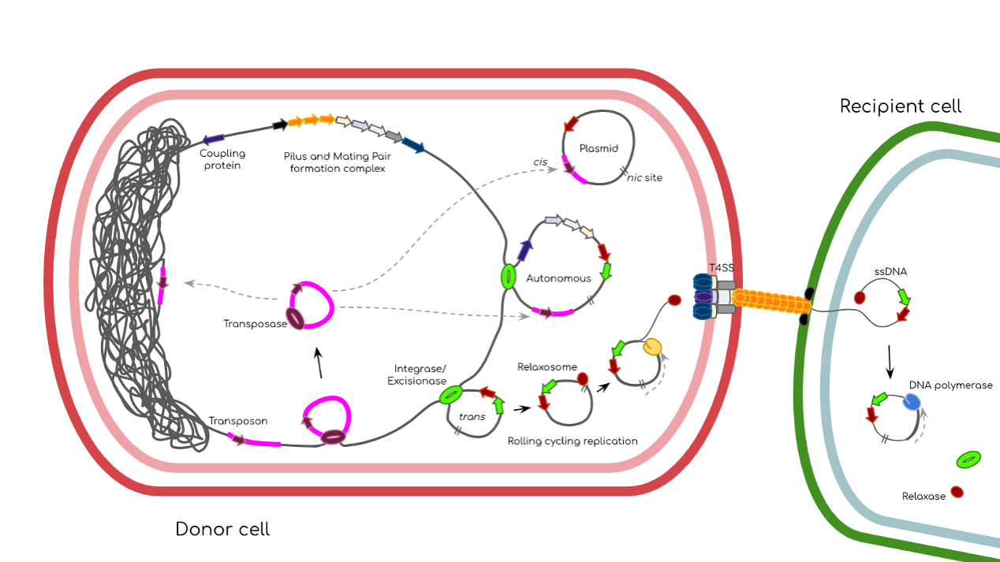

# MoMofy
Module for integrative Mobilome prediction



Bacteria can acquire genetic material through horizontal gene transfer, allowing them to rapidly adapt to changing environmental conditions. These mobile genetic elements can be classified into three main categories: plasmids, phages, and integrons. Autonomous elements are those capable of excising themselves from the chromosome, reintegrating elsewhere, and potentially modifying the host's physiology. Small integrative elements like insertion sequences usually contain one or two genes and are frequently present in multiple copies in the genome, whereas large elements like integrative conjugative elements, often carry multiple cargo genes. The acquisition of large mobile genetic elements may provide genes for defence against other mobile genetic elements or impart new metabolic capabilities to the host.

MoMofy is a wraper that integrates the ouptput of different tools designed for the prediction of autonomous integrative mobile genetic elements in prokaryotic genomes and metagenomes. 

## Contents
- [ Workflow ](#wf)
- [ Setup ](#sp)
- [ MoMofy install and dependencies ](#install)
- [ Inputs ](#in)
- [ Outputs ](#out)
- [ Tests ](#test)
- [ Citation ](#cite)


<a name="wf"></a>
## Workflow


<a name="sp"></a>
## Setup

This workflow is built using [Nextflow](https://www.nextflow.io/).  It uses Docker/Singularity containers making installation trivial and results highly reproducible.
There is one manual step required to build the Docker image for [ICEfinder](https://bioinfo-mml.sjtu.edu.cn/ICEfinder/index.php), we can't distribute that software due to license issues. 

- Install [Nextflow version >=21.10](https://www.nextflow.io/docs/latest/getstarted.html#installation)
- Install [Docker](https://docs.docker.com/get-docker/)
- Install [Singularity](https://github.com/apptainer/singularity/blob/master/INSTALL.md)

<a name="install"></a>
## MoMofy install and dependencies

To install MoMofy, clone this repo by:

```bash
$ git clone https://github.com/EBI-Metagenomics/momofy.git
```

The mobileOG-database is required to run an extra step of annotation on the mobilome coding sequences. The first time you run MoMofy, you will need to download the [Beatrix 1.6 v1](https://mobileogdb.flsi.cloud.vt.edu/entries/database_download) database, move the tarball to `/PATH/momofy/databases`, decompress it, and run the script to format the db for diamond:

```bash
$ mv beatrix-1-6_v1_all.zip /PATH/momofy/databases
$ cd /PATH/momofy/databases
$ unzip beatrix-1-6_v1_all.zip
$ nextflow run format_mobileOG.nf
```

Most of the tools are available on [quay.io](https://quay.io) and no install is needed. 

In the case of ICEfinder, you will need to contact the author to get a copy of the software, visit the [ICEfinder website](https://bioinfo-mml.sjtu.edu.cn/ICEfinder/download.html) for more information. Once you have the `ICEfinder_linux.tar.gz` tarball, move it to `momofy/templates/icefinder/` and build the docker image:

```bash
$ mv ICEfinder_linux.tar.gz /PATH/momofy/templates/icefinder/
$ cd /PATH/momofy/templates/icefinder/
$ docker build -t my_icefinder .
```

PaliDIS is an optional step on the workflow and the install is optional as well. Please visit the [PaliDIS repo](https://github.com/blue-moon22/PaliDIS) for installing instructions.


<a name="in"></a>
## Inputs

To run MoMofy create a directory per sample and launch the tool from the sample directory. If you have many samples, you can use a list of sample IDs to iterate on and to create all directories and subdirectories in a one-line command. Here is an example on how to create softlinks to the assembly files in case you have all of them together on the same directory:

```bash
$ for sample in $(cat samples.list); do (mkdir -p $sample/raw_data && cd $sample/raw_data && ln -s /path/to/assemblies/$sample.fasta contigs.fasta ); done
```

One input file is mandatory in a folder called `raw_data`:
- (meta)genomic assembly file in fasta format (uncompress)

Your sample directory should look like this:

```bash
$ cd sample_dir
$ tree 
.
└── raw_data/
    └── contigs.fasta
```

Basic usage:

```bash
$ nextflow run /PATH/momofy/momofy.nf --assembly raw_data/contigs.fasta my_icefinder 
```

Note that the final output in gff format is created adding information to PROKKA output. If you have your own protein prediction files, provide the gff and the fasta file of amino acid sequences (both files are mandatory with this option). These files will be used for Diamond annotation and CDS coordinates mapping to the MGEs boundaries. Put the relevant files on your `raw_data` directory:

```bash
$ cd sample_dir
$ tree 
.
└── raw_data/
    ├── contigs.fasta
    ├── proteins.faa
    └── annotation.gff
``` 

Then, run momofy with the following parametra:

```bash
$ nextflow run /PATH/momofy/momofy.nf --assembly raw_data/contigs.fasta \
    --user_genes true \
    --prot_fasta raw_data/proteins.faa \
    --prot_gff raw_data/annotation.gff \
    -with-docker my_icefinder 
```

If you want to incorporate PaliDIS predictions to the final output, you will need to put the two outputs of PaliDIS (FASTA file of insertion sequences and the information for each insertion sequence file) in a folder called `palidis_results` inside your sample directory. Your directories structure should looks like:

```bash
$ tree
.
├── raw_data/
│   └── contigs.fasta
└── palidis_results/
    ├── sample_insertion_sequences.fasta
    └── sample_insertion_sequences_info.txt
```

Then, you can run MoMofy using the following command:

```bash
$ nextflow run /PATH/momofy/momofy.nf --assembly raw_data/contigs.fasta \
    --palidis true \
    --palidis_fasta palidis_results/sample_insertion_sequences.fasta \
    --palidis_info palidis_results/sample_insertion_sequences_info.txt \
    -with-docker my_icefinder
```

Finally, if you have protein files and PaliDIS outputs, you can run:

```bash
$ nextflow run /PATH/momofy/momofy.nf --assembly raw_data/contigs.fasta \
    --user_genes true \
    --prot_fasta raw_data/proteins.faa \
    --prot_gff raw_data/annotation.gff \
    --palidis true \
    --palidis_fasta palidis_results/sample_insertion_sequences.fasta \
    --palidis_info palidis_results/sample_insertion_sequences_info.txt \
    -with-docker my_icefinder 
```

A GFF validation process is used to detect formatting errors in the final GFF3 output. This process can be skipped adding `--gff-validation false`.


<a name="out"></a>
## Outputs

The main outputs of MoMofy are in the `MoMofy_results`. There you will find the following files:

```bash
$ tree MoMofy_results
MoMofy_results/
├── discarded_mge.txt
├── momofy_predictions.fna
├── momofy_predictions.gff
└── nested_integrons.txt
```

The labels used in the Type column of the gff file corresponds to the following nomenclature according to the [Sequence Ontology resource](http://www.sequenceontology.org/browser/current_svn/term/SO:0000001):

| Type in gff file  | Sequence ontology ID | Element description | Reporting tool |
| ------------- | ------------- | ------------- | ------------- |
| insertion_sequence | [SO:0000973](http://www.sequenceontology.org/browser/current_svn/term/SO:0000973) | Insertion sequence | ISEScan, PaliDIS |
| terminal_inverted_repeat_element | [SO:0000481](http://www.sequenceontology.org/browser/current_svn/term/SO:0000481) | Terminal Inverted Repeat (TIR) flanking insertion sequences | ISEScan, PaliDIS |
| integron  | [SO:0000365](http://www.sequenceontology.org/browser/current_svn/term/SO:0000365) | Integrative mobilizable element | IntegronFinder, ICEfinder |
| attC_site | [SO:0000950](http://www.sequenceontology.org/browser/current_svn/term/SO:0000950) | Integration site of DNA integron | IntegronFinder |
| conjugative_transposon  | [SO:0000371](http://www.sequenceontology.org/browser/current_svn/term/SO:0000371) | Integrative Conjugative Element | ICEfinder |
| direct_repeat | [SO:0000314](http://www.sequenceontology.org/browser/current_svn/term/SO:0000371) | Flanking regions on mobilizable elements | ICEfinder |
| CDS | [SO:0000316](http://www.sequenceontology.org/browser/current_svn/term/SO:0000316) | Coding sequence | Prodigal |


Additionally, you will see the following directories containing the main outputs of each tool. This is a minimal example omiting the `raw_data` directory:

```bash
$ tree
.
├── icefinder_results
│   ├── gbk
│   │   └── contig.prokka_1.gbk
│   ├── input.list
│   ├── result
│   │   ├── icf_concat.fasta
│   │   └── icf_concat.summary
│   └── tmp
│       └── contig.prokka_1
├── integron_results
│   └── Results_Integron_Finder_contigs
│       ├── contig_1.gbk
│       └── contigs.summary
├── isescan_results
│   ├── contigs.fasta.is.fna
│   └── contigs.fasta.tsv
├── mobileog_results
│   └── blastp_out.tsv
└── preprocessing
    ├── 1kb_contigs.fasta
    ├── 5kb_contigs.fasta
    ├── contigID.map
    └── prokka_out
        └── contigs.gbk
```

<a name="test"></a>
## Tests

Nextflow tests are executed with [nf-test](https://github.com/askimed/nf-test).

Run:
```bash
$ cd test
$ nf-test test *.nf.test
```

<a name="cite"></a>
## Citation

If you use MoMofy on your data analysis, please cite:

XXXXX


MoMofy is a wrapper that integrates the output of the following tools and DBs:

1) ISEScan v1.7.2.3 [Xie et al., Bioinformatics, 2017](https://doi.org/10.1093/bioinformatics/btx433)
2) IntegronFinder2 v2.0.2 [Néron et al., Microorganisms, 2022](https://doi.org/10.3390/microorganisms10040700)
3) ICEfinder v1.0 [Liu et al., Nucleic Acids Research, 2019](https://doi.org/10.1093/nar/gky1123)
4) PaliDIS [Carr et al., biorxiv, 2022](https://doi.org/10.1101/2022.06.27.497710)

Databases:
- MobileOG-DB Beatrix 1.6 v1 [Brown et al., Appl Environ Microbiol, 2022](https://doi.org/10.1128/aem.00991-22)
