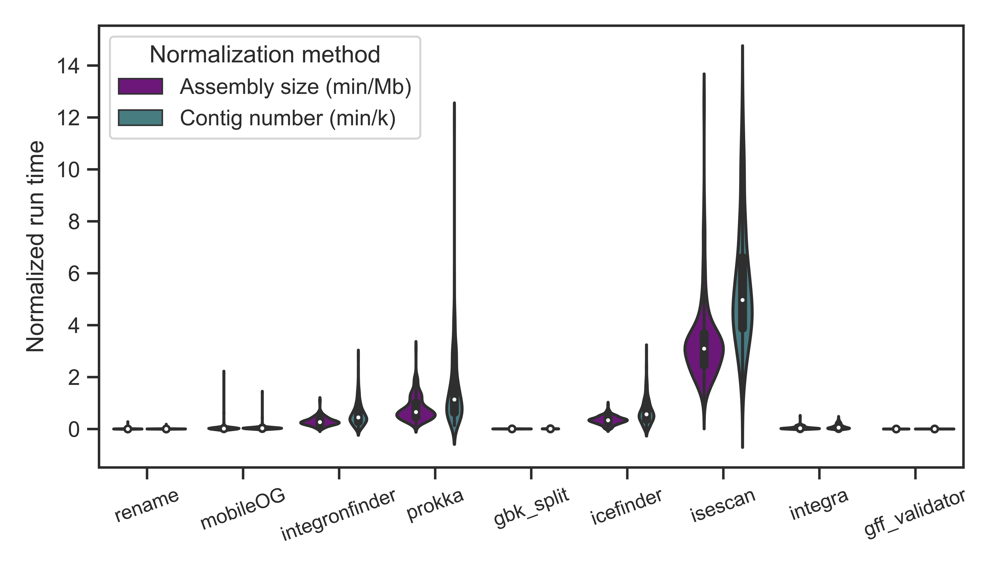
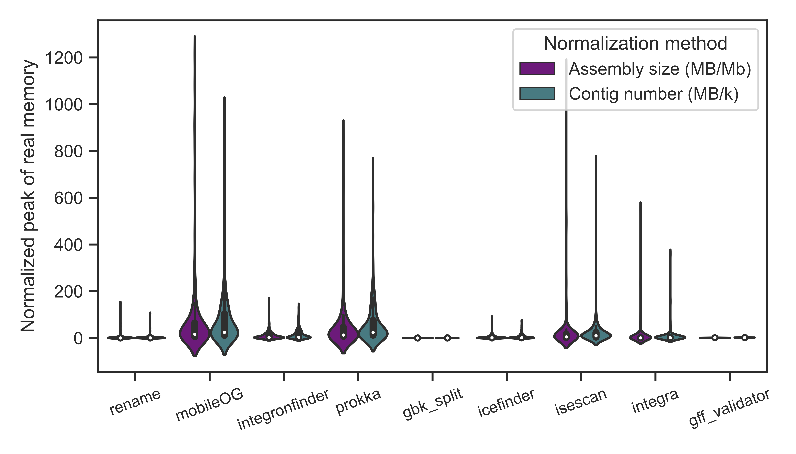
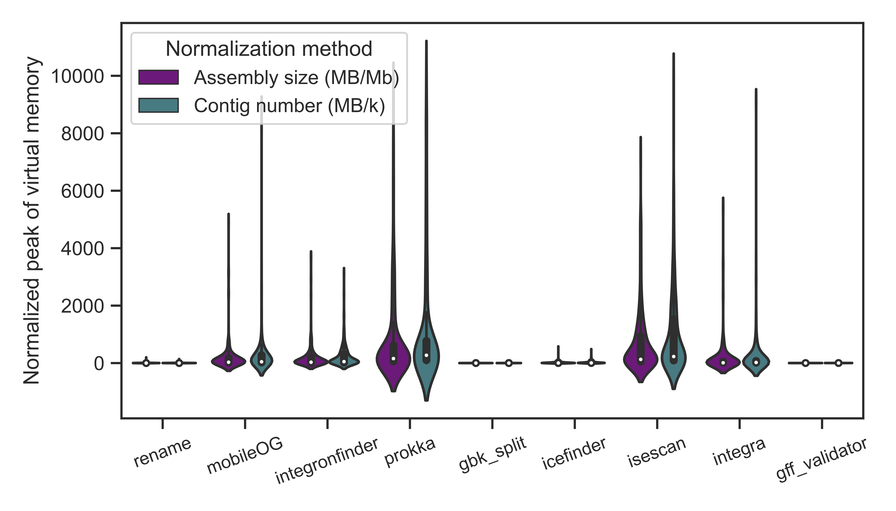

# MoMofy: Module for integrative Mobilome prediction

<p align="center" width="100%">
   
</p>

Bacteria can acquire genetic material through horizontal gene transfer, allowing them to rapidly adapt to changing environmental conditions. These mobile genetic elements can be classified into three main categories: plasmids, phages, and integrons. Autonomous elements are those capable of excising themselves from the chromosome, reintegrating elsewhere, and potentially modifying the host's physiology. Small integrative elements like insertion sequences usually contain one or two genes and are frequently present in multiple copies in the genome, whereas large elements like integrative conjugative elements, often carry multiple cargo genes. The acquisition of large mobile genetic elements may provide genes for defence against other mobile genetic elements or impart new metabolic capabilities to the host.

MoMofy is a wrapper that integrates the ouptput of different tools designed for the prediction of autonomous integrative mobile genetic elements in prokaryotic genomes and metagenomes. Note that prophages detection is out of scope of MoMofy.

## Contents
- [ Workflow ](#wf)
- [ Setup ](#sp)
- [ MoMofy install and dependencies ](#install)
- [ Usage ](#usage)
- [ Inputs ](#in)
- [ Outputs ](#out)
- [ Tests ](#test)
- [ Performance ](#profile)
- [ Citation ](#cite)


<a name="wf"></a>
## Workflow


<a name="sp"></a>
## Setup

This workflow is built using [Nextflow](https://www.nextflow.io/). It uses Singularity containers making installation trivial and results highly reproducible.
Explained in this section section, there is one manual step required to build the singularity image for [ICEfinder](https://bioinfo-mml.sjtu.edu.cn/ICEfinder/index.php), as we can't distribute that software due to license issues.

- Install [Nextflow version >=21.10](https://www.nextflow.io/docs/latest/getstarted.html#installation)
- Install [Singularity](https://github.com/apptainer/singularity/blob/master/INSTALL.md)

<a name="install"></a>
## MoMofy install and dependencies

To install MoMofy, clone this repo by:

```bash
$ git clone https://github.com/EBI-Metagenomics/momofy.git
```

The mobileOG-database is required to run an extra step of annotation on the mobilome coding sequences. The first time you run MoMofy, you will need to download the [Beatrix 1.6 v1](https://mobileogdb.flsi.cloud.vt.edu/entries/database_download) database, move the tarball to `/PATH/momofy/databases`, decompress it, and run the script to format the db for diamond:

```bash
$ mv beatrix-1-6_v1_all.zip /PATH/momofy/databases
$ cd /PATH/momofy/databases
$ unzip beatrix-1-6_v1_all.zip
$ nextflow run /PATH/momofy/format_mobileOG.nf
```

Most of the tools are available on [quay.io](https://quay.io) and no install is needed. 

In the case of ICEfinder, you will need to contact the author to get a copy of the software, visit the [ICEfinder website](https://bioinfo-mml.sjtu.edu.cn/ICEfinder/download.html) for more information. Once you have the `ICEfinder_linux.tar.gz` tarball, move it to `momofy/templates` and build the singularity image using the following command:

```bash
$ mv ICEfinder_linux.tar.gz /PATH/momofy/templates/
$ cd /PATH/momofy/templates/
$ sudo singularity build ../../singularity/icefinder-v1.0-local.sif icefinder-v1.0-local.def
```

PaliDIS is an optional step on the workflow and the install is optional as well. Visit [PaliDIS repo](https://github.com/blue-moon22/PaliDIS) for installing instructions.

If you are aim to run the pipeline in a system with jobs scheduler as LSF or SGE, set up a config file and provide it as part of the arguments as follows:

```bash
$ nextflow run /PATH/momofy/momofy.nf --assembly contigs.fasta -c /PATH/configs/some_cluster.config
```

You can find an example in the `configs` directory of this repo.


<a name="usage"></a>
## Usage

Running the tool with `--help` option will display the following message:

```bash
$ nextflow run /PATH/momofy/momofy.nf --help
N E X T F L O W  ~  version 21.10.0
Launching `momofy.nf` [gigantic_pare] - revision: XXXXX

	MoMofy is a wraper that integrates the ouptput of different tools designed for the prediction of autonomous integrative mobile genetic elements in prokaryotic genomes and metagenomes.

        Usage:
         The basic command for running the pipeline is as follows:

         nextflow run momofy.nf --assembly contigs.fasta

         Mandatory arguments:
          --assembly                     (Meta)genomic assembly in fasta format (uncompress)

         Optional arguments:
          --user_genes                    User annotation files. See --prot_fasta and --prot_gff [ default = false ]
          --prot_gff                      Annotation file in GFF3 format. Mandatory with --user_genes true
          --prot_fasta                    Fasta file of aminoacids. Mandatory with --user_genes true
          --palidis                       Incorporate PaliDIS predictions to final output [ default = false ]
          --palidis_fasta                 Fasta file of PaliDIS insertion sequences. Mandatory with --palidis true
          --palidis_info                  Information file of PaliDIS insertion sequences. Mandatory with --palidis true
          --gff_validation                Run a step of format validation on the GFF3 file output [ default = true ]
          --outdir                        Output directory to place final MoMofy results [ default = MoMofy_results ]
          --help                          This usage statement [ default = false ]
```

<a name="in"></a>
## Inputs

To run MoMofy in multiple samples, create a directory per sample and launch the tool from the sample directory. The only mandatory input is the (meta)genomic assembly file in fasta format (uncompress).

Basic run:

```bash
$ nextflow run /PATH/momofy/momofy.nf --assembly contigs.fasta
```

Note that the final output in gff format is created by adding information to PROKKA output. If you have your own protein prediction files, provide the gff and the fasta file of amino acid sequences (both uncompressed files are mandatory with this option). These files will be used for Diamond annotation and CDS coordinates mapping to the MGEs boundaries. If any original annotation is present in the gff file, it will remained untouched.

Running MoMofy with user's genes prediction:

```bash
$ nextflow run /PATH/momofy/momofy.nf --assembly contigs.fasta \
    --user_genes true \
    --prot_fasta proteins.faa \
    --prot_gff annotation.gff \
```

If you want to incorporate PaliDIS predictions to the final output, provide the path of the two outputs of PaliDIS (fasta file of insertion sequences and the information for each insertion sequence file).

To run MoMofy incorporating PaliDIS results:

```bash
$ nextflow run /PATH/momofy/momofy.nf --assembly contigs.fasta \
    --palidis true \
    --palidis_fasta insertion_sequences.fasta \
    --palidis_info insertion_sequences_info.txt \
```

Then, if you have protein files and PaliDIS outputs, you can run:

```bash
$ nextflow run /PATH/momofy/momofy.nf --assembly contigs.fasta \
    --user_genes true \
    --prot_fasta proteins.faa \
    --prot_gff annotation.gff \
    --palidis true \
    --palidis_fasta insertion_sequences.fasta \
    --palidis_info insertion_sequences_info.txt \
```

A GFF validation process is used to detect formatting errors in the final GFF3 output. This process can be skipped adding `--gff_validation false` to the command.


<a name="out"></a>
## Outputs

Results will be written by default in the `MoMofy_results` directory inside the sample dir unless the user define `--outdir` option. There you will find the following output files:

```bash
MoMofy_results/
├── discarded_mge.txt
├── momofy_predictions.fna
├── momofy_predictions.gff
└── nested_integrons.txt
```

The main MoMofy output files are the `momofy_predictions.fna` containing the nucleotide sequences of every prediction, and the `momofy_predictions.gff` containing the mobilome annotation plus any other feature annotated by PROKKA or in the gff file provided by the user with the option `--user_genes`. 

A unique MGE ID is generated per MGE in the following format separated by underscore:
1. Three letters code denoting the tool used for prediction: iss (ISEScan), pal (PaliDIS), icf (ICEfinder), inf (IntegronFinder)
2. An integer number

Headers in the fasta file have additional information separated by the pipe character:
1. MGE ID
2. Contig ID
3. Start and end coordinates separated by '..'
4. MGE description

Example:
```bash
> iss_1|contig_1|1..1000|IS630_with_TIR
```

The MGE ID is used in the first field of the attributes column of the GFF3 file with the key 'ID'. A short MGE description is included in the attributes field with the key 'mobile_element_type'.

Any CDS with a coverage >= 0.75 in the boundaries of a predicted MGE in link to the corresponding element by appending the key 'from_mge' followd by the MGE ID in the attributes field. In addition, when a match versus the mobileOG-DB has been found, the annotation is append to the corresponding gene in the attributes field with the key 'mobileOG'.

The labels used in the Type column of the gff file corresponds to the following nomenclature according to the [Sequence Ontology resource](http://www.sequenceontology.org/browser/current_svn/term/SO:0000001):

| Type in gff file  | Sequence ontology ID | Element description | Reporting tool |
| ------------- | ------------- | ------------- | ------------- |
| insertion_sequence | [SO:0000973](http://www.sequenceontology.org/browser/current_svn/term/SO:0000973) | Insertion sequence | ISEScan, PaliDIS |
| terminal_inverted_repeat_element | [SO:0000481](http://www.sequenceontology.org/browser/current_svn/term/SO:0000481) | Terminal Inverted Repeat (TIR) flanking insertion sequences | ISEScan, PaliDIS |
| integron  | [SO:0000365](http://www.sequenceontology.org/browser/current_svn/term/SO:0000365) | Integrative mobilizable element | IntegronFinder, ICEfinder |
| attC_site | [SO:0000950](http://www.sequenceontology.org/browser/current_svn/term/SO:0000950) | Integration site of DNA integron | IntegronFinder |
| conjugative_transposon  | [SO:0000371](http://www.sequenceontology.org/browser/current_svn/term/SO:0000371) | Integrative Conjugative Element | ICEfinder |
| direct_repeat | [SO:0000314](http://www.sequenceontology.org/browser/current_svn/term/SO:0000371) | Flanking regions on mobilizable elements | ICEfinder |
| CDS | [SO:0000316](http://www.sequenceontology.org/browser/current_svn/term/SO:0000316) | Coding sequence | Prodigal |


The file `discarded_mge.txt` contains a list of predictions that were discarded, along with the reason for their exclusion. Possible reasons include:

1. overlapping	For insertion sequences only, ISEScan prediction is discarded if an overlap with PaliDIS is found. 
2. mge<500bp	Discarded by length.
3. no_cds	If there are no genes encoded in the prediction.

The file `nested_integrons.txt` is a report of overlapping predictions reported by IntegronFinder and ICEfinder. No predictions are discarded in this case.

Additionally, you will see the directories containing the main outputs of each tool.

<a name="test"></a>
## Tests

Nextflow tests are executed with [nf-test](https://github.com/askimed/nf-test). It takes around 3 min in executing.

Run:

```bash
$ cd /PATH/momofy
$ nf-test test *.nf.test
```

<a name="profile"></a>
## Performance

MoMofy performance was profiled using 460 public metagenomic assemblies and co-assemblies of chicken gut (ERP122587, ERP125074, and ERP131894) with sizes ranging from ~62 K to ~893 M assembled bases. We used the metagenomic assemblies, CDS prediction and annotation files generated by MGnify v5 pipeline, and PaliDIS outputs generated after downsampling the number of reads to 10 M. MoMofy was run adding the following options: `-with-report -with-trace -with-timeline timeline.out`.


<p align="center" width="100%">
   
</p>
<p align="center" width="100%">
   
   
</p>


<a name="cite"></a>
## Citation

If you use MoMofy on your data analysis, please cite:

XXXXX


MoMofy is a wrapper that integrates the output of the following tools and DBs:

1) ISEScan v1.7.2.3 [Xie et al., Bioinformatics, 2017](https://doi.org/10.1093/bioinformatics/btx433)
2) IntegronFinder2 v2.0.2 [Néron et al., Microorganisms, 2022](https://doi.org/10.3390/microorganisms10040700)
3) ICEfinder v1.0 [Liu et al., Nucleic Acids Research, 2019](https://doi.org/10.1093/nar/gky1123)
4) PaliDIS [Carr et al., biorxiv, 2022](https://doi.org/10.1101/2022.06.27.497710)

Databases:
- MobileOG-DB Beatrix 1.6 v1 [Brown et al., Appl Environ Microbiol, 2022](https://doi.org/10.1128/aem.00991-22)
