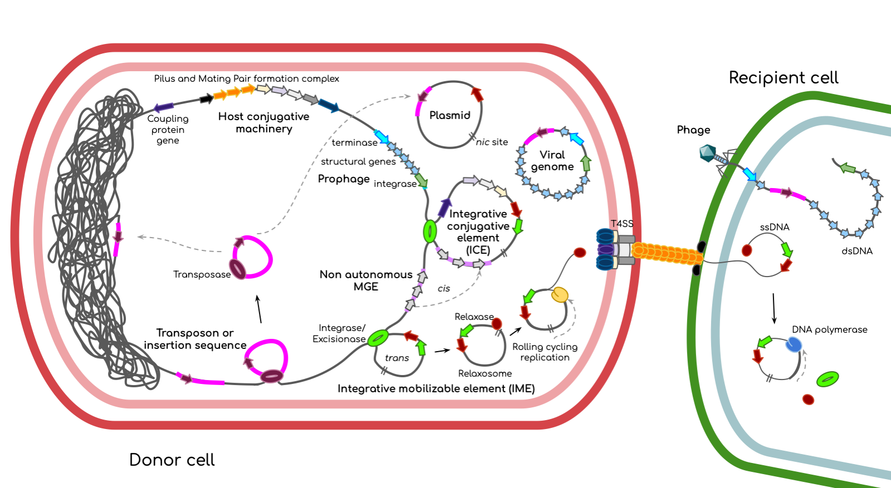
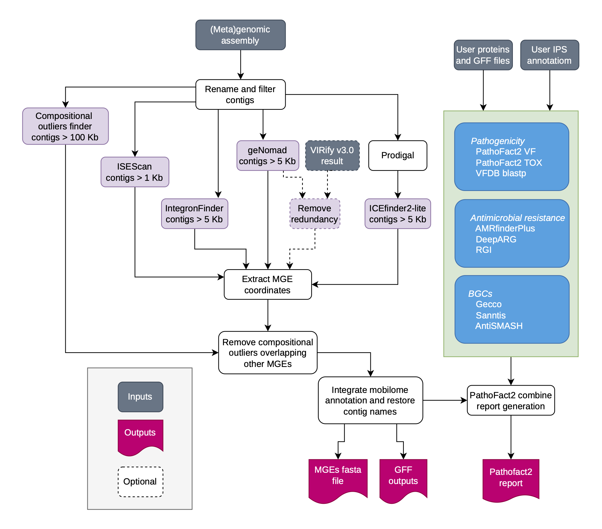

[](https://github.com/EBI-Metagenomics/mobilome-annotation-pipeline/actions/workflows/test_modules.yml)

# Mobilome Annotation Pipeline (MAP)

<p align="center" width="100%">
   
</p>

Bacteria can acquire genetic material through horizontal gene transfer, allowing them to rapidly adapt to changing environmental conditions. These mobile genetic elements can be classified into three main categories: plasmids, phages, and integrative elements. Plasmids are mostly extrachromosomal; phages can be found extrachromosomal or as temperate phages (prophages); whereas integrons are stably inserted in the chromosome. Autonomous elements are those integrative elements capable of excising themselves from the chromosome and reintegrating elsewhere. They can use a transposase (like insertion sequences and transposons) or an integrase/excisionase (like ICEs and IMEs).

The Mobilome Annotation Pipeline integrates the output of different tools designed for the prediction of plasmids, phages, insertion sequences, integrative mobile genetic elements (ICEs, IMEs), integrons, and non-autonomous mobile genetic elements in prokaryotic genomes and metagenomes. The primary output is a compressed GFF3 file of the mobilome annotation. Since v5, MAP also runs functional annotation subworkflows for antimicrobial resistance (AMR), virulence factors, and biosynthetic gene clusters (BGCs), producing a combined per-protein report.

## Contents

- [Workflow](#wf)
- [Install and dependencies](#install)
- [Usage](#usage)
- [Functional annotation](#functional)
- [Outputs](#out)
- [Tests](#test)
- [License and Attribution](#license)
- [Citation](#cite)

Full documentation: [docs/usage.md](docs/usage.md) · [docs/outputs.md](docs/outputs.md)

<a name="wf"></a>

## Workflow

<p align="center" width="100%">
   
</p>

The pipeline has five main stages:

**1. Preprocessing** — Contigs are filtered by length and renamed to short IDs (`RENAME`). CDS are annotated with Prodigal; tRNAs with ARAGORN.

**2. MGE prediction** (parallel) — geNomad (plasmids/phages), ICEfinder2-lite (ICEs/IMEs), IntegronFinder (integrons), ISEScan (insertion sequences), and a compositional outlier detection subworkflow (contigs ≥100 kb).

**3. Integration** — All predictions are merged into a single `{sample}_mobilome.gff.gz`. Predictions <500 bp or with no CDS are discarded.

**4. Functional annotation** — Three independent subworkflows annotate virulence factors, antimicrobial resistance genes (ARG) and biosynthetic gene clusters (BGC):
- **PATHOFACT2**: toxin and virulence factor prediction via machine learning and DIAMOND vs VFDB.
- **AMR_ANNOTATION**: antimicrobial resistance gene detection with AMRFinderPlus, DeepARG, and RGI (CARD).
- **BGC_ANNOTATION**: biosynthetic gene cluster prediction and overlps merging with SanntiS, GECCO, and antiSMASH.

**5. Pathofact2-style report** — Virulence factor and ARG report in the context of BGCs and MGEs.


<a name="install"></a>

## Install and dependencies

The only prerequisites are [Nextflow](https://www.nextflow.io/) and a container tool such as [Docker](https://www.docker.com/) or [Singularity](https://docs.sylabs.io/guides/3.5/user-guide/introduction.html).

Download all required databases with:

```bash
nextflow run EBI-Metagenomics/mobilome-annotation-pipeline \
    --download_dbs /path/to/dbs \
    -profile singularity
```

On completion the pipeline prints a ready-to-paste params config block. See [docs/usage.md](docs/usage.md) for the full setup guide including the config snippet and InterProScan notes.

<a name="usage"></a>

## Usage

Prepare a samplesheet (only `sample` and `assembly` are required):

```csv
sample,assembly,proteins_gff,proteins_faa,virify_gff,interproscan_tsv
sample1,/PATH/assembly.fasta,,,,
sample2,/PATH/assembly.fasta,/PATH/proteins.gff,/PATH/proteins.faa,,/PATH/ips.tsv
```

```bash
nextflow run EBI-Metagenomics/mobilome-annotation-pipeline \
    --input samplesheet.csv \
    -c my_paths.config \
    -profile singularity
```

See [docs/usage.md](docs/usage.md) for the full samplesheet column reference, InterProScan details, skip flags, and mobilome-only mode.

<a name="functional"></a>

## Functional annotation

MAP runs three independent functional annotation subworkflows after mobilome prediction: **PATHOFACT2** (toxins/virulence), **AMR_ANNOTATION** (AMRFinderPlus, DeepARG, RGI), and **BGC_ANNOTATION** (SanntiS, GECCO, antiSMASH). Each tool can be skipped individually.

See [docs/usage.md](docs/usage.md) for skip flags, mobilome-only mode, and annotation manifest reuse.

<a name="out"></a>

## Outputs

Results are written to `--outdir` (default: `results/`).

```
{sample}/
├── {sample}_combined_report.tsv
├── {sample}_discarded_mge.txt
├── {sample}_mobilome.fasta.gz
├── {sample}_overlap_report.txt
├── gff/
├── prediction/
└── preprocessing/
```

See [docs/outputs.md](docs/outputs.md) for the full directory layout, discarded prediction reasons, GFF feature type definitions, and combined report column reference.

<a name="test"></a>

## Tests

Nextflow integration tests use [nf-test](https://github.com/askimed/nf-test). The full suite takes ~10 minutes.

```bash
cd mobilome-annotation-pipeline/
nf-test test --profile test,singularity
```

Individual test tags: `positive`, `negative`, `pathofact`.

Python unit tests for `bin/` scripts use [pytest](https://pytest.org/):

```bash
task setup-venv   # once
task test
```

## Development Tasks

This project uses [Task](https://taskfile.dev/) and [uv](https://docs.astral.sh/uv/) for development workflow management.

```bash
task setup-venv              # Bootstrap Python virtual environment
task test                    # Run all pytest tests
task test-verbose            # Run pytest with verbose output
task test-coverage           # Run pytest with HTML coverage report
task test-specific -- <pat>  # Run a specific test file or pattern
task clean                   # Remove virtual environment
```

<a name="license"></a>

## License and Attribution

### ICEfinder2 Attribution

This pipeline includes scripts derived from or inspired by ICEfinder2 algorithms and methods. The following scripts contain code adapted from ICEfinder2:

- `bin/ice_boundary_refinement.py` — ICE boundary refinement and direct repeat processing
- `bin/map_tools/icefinder_process.py` — ICE result processing and data formatting
- `bin/prescan_to_fasta.py` — ICE prescanning and candidate detection methods

**ICEfinder2 License**: These algorithms are used under the Creative Commons Attribution-NonCommercial-ShareAlike 4.0 International License (CC BY-NC-SA 4.0).

- Original work: ICEfinder2 (http://creativecommons.org/licenses/by-nc-sa/4.0/)
- Modifications: Licensed under Apache 2.0 by EMBL-EBI

<a name="cite"></a>

## Citation

An extensive list of references for the tools used by the pipeline can be found in the [`CITATIONS.md`](CITATIONS.md) file.

This pipeline uses code and infrastructure developed and maintained by the [nf-core](https://nf-co.re) community, reused here under the [MIT license](https://github.com/nf-core/tools/blob/main/LICENSE).

> **The nf-core framework for community-curated bioinformatics pipelines.**
>
> Philip Ewels, Alexander Peltzer, Sven Fillinger, Harshil Patel, Johannes Alneberg, Andreas Wilm, Maxime Ulysse Garcia, Paolo Di Tommaso & Sven Nahnsen.
>
> _Nat Biotechnol._ 2020 Feb 13. doi: [10.1038/s41587-020-0439-x](https://dx.doi.org/10.1038/s41587-020-0439-x).

