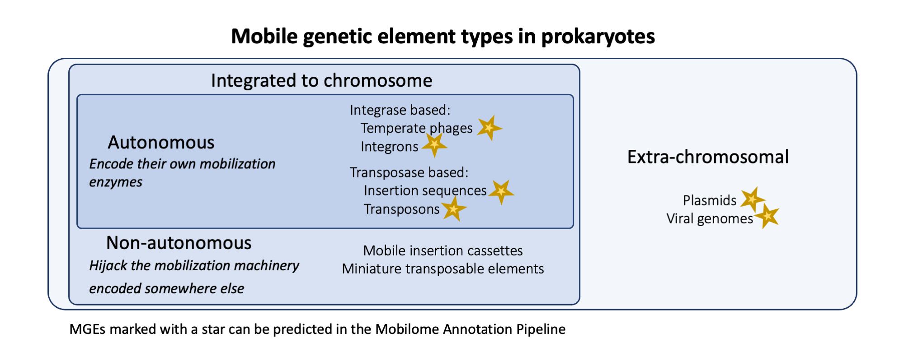

[](https://github.com/EBI-Metagenomics/mobilome-annotation-pipeline/actions/workflows/test_modules.yml)

# Mobilome Annotation Pipeline (former MoMofy)

<p align="center" width="100%">
   
</p>

Bacteria can acquire genetic material through horizontal gene transfer, allowing them to rapidly adapt to changing environmental conditions. These mobile genetic elements can be classified into three main categories: plasmids, phages, and integrative elements. Plasmids are mostly extrachromosmal; phages can be found extrachromosmal or as temperate pahes (prophages); whereas integrons are stable inserted in the chromosome. Autonomous elements are those integrative elements capable of excising themselves from the chromosome and reintegrate elsewhere. They can use a transposase (like insertion sequences and transposons) or an integrase/excisionase (like ICEs and IMEs).

The Mobilome Annotation Pipeline is a wrapper that integrates the output of different tools designed for the prediction of plasmids, phages and autonomous integrative mobile genetic elements in prokaryotic genomes and metagenomes. The output is PROKKA gff file with extra entries for the mobilome.


## Contents
- [ Workflow ](#wf)
- [ Setup ](#sp)
- [ Install and dependencies ](#install)
- [ Usage ](#usage)
- [ Inputs ](#in)
- [ Outputs ](#out)
- [ Tests ](#test)
- [ Citation ](#cite)


<a name="wf"></a>
## Workflow

<p align="center" width="100%">
   
</p>

This workflow has the folowing main subworkflows:
 - Preprocessing: Rename and filter contigs, and run PROKKA annotation
 - Prediction: Run geNomad, ICEfinder, IntegronFinder, and ISEScan 
 - Annotation: Generate extra-annotation for antimicrobial resistance genes (AMRFinderPlus), CRISPRCas, and other mobilome-related proteins (MobileOG).
 - Integration: Parse and integrate the outputs generated on `Prediction` and `Annotation` subworkflows. In this step optional results of VIRify and PaliDis can be incorporated. MGEs <500 bp lengh and predictions with no genes are discarded.
 - Postprocessing: Write the mobilome fasta file, write a report of the location of AMR genes (either mobilome or chromosome), and generate three new GFF files:
1. `mobilome_clean.gff`: mobilome + associated CDSs
2. `mobilome_extra.gff`: mobilome + ViPhOGs/mobileOG annotated genes (note that ViPhOG annotation is generated by VIRify)
3. `mobilome_nogenes.gff`: mobilome only
The output `mobilome_nogenes.gff` is validated in this subworkflow.


<a name="sp"></a>
## Setup

This workflow is built using [Nextflow](https://www.nextflow.io/). It uses Singularity containers making installation trivial and results highly reproducible.
Explained in this section, there is one manual step required to build the singularity image for [ICEfinder](https://bioinfo-mml.sjtu.edu.cn/ICEfinder/index.php), as we can't distribute that software due to license issues.

- Install [Nextflow version >=21.10](https://www.nextflow.io/docs/latest/getstarted.html#installation)
- Install [Singularity](https://github.com/apptainer/singularity/blob/master/INSTALL.md)

<a name="install"></a>
## Install and dependencies

To get a copy of the Mobilome Annotation Pipeline, clone this repo by:

```bash
$ git clone https://github.com/EBI-Metagenomics/mobilome-annotation-pipeline.git
```

The mobileOG-database is required to run an extra step of annotation on the mobilome coding sequences. The first time you run MoMofy, you will need to download the [Beatrix 1.6 v1](https://mobileogdb.flsi.cloud.vt.edu/entries/database_download) database, move the tarball to `mobilome-annotation-pipeline/databases`, decompress it, and run the script to format the db for diamond:

```bash
$ mv beatrix-1-6_v1_all.zip /PATH/mobilome-annotation-pipeline/databases
$ cd /PATH/mobilome-annotation-pipeline/databases
$ unzip beatrix-1-6_v1_all.zip
$ nextflow run /PATH/mobilome-annotation-pipeline/format_mobileOG.nf
```

Two additional databases need to be manually downloaded and extracted: [AMRFinder plus db](https://ftp.ncbi.nlm.nih.gov/pathogen/Antimicrobial_resistance/AMRFinderPlus/database/latest) and the [geNomad database](https://zenodo.org/records/8339387) databases. Then you can provide the paths to your databases using the `mobileog_db`, the `amrfinder_plus_db` and the `genomad_db` respectively when you run the pipeline.

Most of the tools are available on [quay.io](https://quay.io) and no install is needed. However, in the case of ICEfinder, you will need to contact the author to get a copy of the software, visit the [ICEfinder website](https://bioinfo-mml.sjtu.edu.cn/ICEfinder/download.html) for more information. Once you have the `ICEfinder_linux.tar.gz` tarball, move it to `mobilome-annotation-pipeline/templates` and build the singularity image using the following command:

```bash
$ mv ICEfinder_linux.tar.gz /PATH/mobilome-annotation-pipeline/templates/
$ cd /PATH/mobilome-annotation-pipeline/templates/
$ sudo singularity build ../../singularity/icefinder-v1.0-local.sif icefinder-v1.0-local.def
```

PaliDIS and VIRIfy are optional steps on the workflow, therefore its installation is optional as well. Visit the corresponding Github sites for installing instructions: [PaliDIS repo](https://github.com/blue-moon22/PaliDIS), [VIRify repo](https://github.com/EBI-Metagenomics/emg-viral-pipeline).


<a name="usage"></a>
## Usage

Running the tool with `--help` option will display the following message:

```bash
$ nextflow run main.nf --help
N E X T F L O W  ~  version 23.04.3
Launching `main.nf` [pensive_newton] DSL2 - revision: b36100bb05

	The Mobilome Annotation Pipeline is a wrapper that integrates the output of different tools designed for the prediction of plasmids, phages and autonomous integrative mobile genetic elements in prokaryotic genomes and metagenomes. The output is PROKKA gff file with extra entries for the mobilome. The defaul tools to run are ISEScan (insertion sequences), IntegronFinder (integrons), geNomad (virus and plasmids), ICEfinder (ICE and IME), PROKKA (cds prediction and general functional annotation), Diamond vs MobileOG database (mobilome functions), AMRfinderplus (AMR annotation), and CRISPRCas (crispr arrays). In addition, the user can provide PaliDIS results to be integrated with ISEScan and VIRify v2.0 results to integrate with geNomad annotation. If the user have a CDS prediction, it can be used to generate an extra gff file with the option --user_genes. See usage below:

        Usage:
         The basic command for running the pipeline is as follows:

         nextflow run main.nf --assembly contigs.fasta

         Mandatory arguments:
          --assembly                      (Meta)genomic assembly in fasta format (uncompress)

         Optional arguments:
    ** Extra annotations provided by the user
        * Genes prediction  
          --user_genes                    Use the user annotation files. See --prot_gff [false]
          --prot_gff                      Annotation file in GFF3 format. Mandatory with '--user_genes true'
        * VIRify (v2.0)
          --virify                        Integrate VIRify v2.0 results to geNomad predictions [false]
          --vir_gff                       The final result of VIRify on gff format (08-final/gff/*.gff). Mandatory with '--virify true'
          --vir_checkv                    CheckV results generated by VIRify (07-checkv/*quality_summary.tsv). Mandatory with '--virify true'
        * PaliDIS (v2.3.4)
          --palidis                       Incorporate PaliDIS predictions to final output [false]
          --palidis_info                  Information file of PaliDIS insertion sequences. Mandatory with '--palidis true'
    ** Extra annotations inside the pipeline
          --skip_crispr                   Not to run CRISPRCasFinder. Default behaviour is to run it [false]
          --skip_amr                      Not to run AMRFinderPlus. Default behaviour is to run it [false]
    ** Final output validation
          --gff_validation                Validation of the GFF3 mobilome output [true]
    ** Output directory
          --outdir                        Output directory to place results [mobilome_results]
    ** Show usage message and exit
          --help                          This usage statement [false]

```

<a name="in"></a>
## Inputs

To run MoMofy on multiple samples, create a directory per sample and launch the tool from the sample directory. The only mandatory input is the (meta)genomic assembly file in fasta format (uncompress).

Basic run:

```bash
$ nextflow run /PATH/mobilome-annotation-pipeline/main.nf --assembly contigs.fasta
```

Note that the final output in gff format is created by adding information to PROKKA output. If you have your own protein prediction files, provide the gff file (uncompressed). This file will be used to generate a `user_mobilome_extra.gff` file containing the mobilome plus any extra annotation generated on the annotation subworkflow.

Running the pipeline with user's gff:

```bash
$ nextflow run /PATH/mobilome-annotation-pipeline/main.nf \
    --assembly contigs.fasta \
    --user_genes true \
    --prot_gff annotation.gff
```

If you want to incorporate PaliDIS predictions to the final output, provide the path to the PaliDIS information for each insertion sequence file.

Running the pipeline incorporating PaliDIS results:

```bash
$ nextflow run /PATH/mobilome-annotation-pipeline/main.nf \
    --assembly contigs.fasta \
    --palidis true \
    --palidis_info insertion_sequences_info.txt
```

If you want to integrate VIRify results to the final output you will need the GFF file with viral predictions and the checkV reports generated by VIRify:

```bash
$ nextflow run /PATH/mobilome-annotation-pipeline/main.nf \
    --assembly contigs.fasta \
    --virify true \
    --vir_gff /PATH/08-final/gff/virify.gff \
    --vir_checkv /PATH/07-checkv/\*quality_summary.tsv 
```

Don't forget to escape the asterisk on the --vir_checkv option for the correct interpretation of Nextflow.


<a name="out"></a>
## Outputs

Results will be written by default in the `mobilome_results` directory unless the `--outdir` option is used. There, you will find the following outputs:

```bash
mobilome_results/
├── mobilome.fasta
├── mobilome_prokka.gff
├── overlapping_integrons.txt
├── discarded_mge.txt
├── func_annot/
├── gff_output_files/
├── prediction/
└── preprocessing
```

If AMRFinderPlus results are generated (`--skip_amr = False` by default), the `func_annot/amr_location.txt` file contains a summary of the AMR genes annotated and their location (either mobilome or chromosome).

The file `discarded_mge.txt` contains a list of predictions that were discarded, along with the reason for their exclusion. Possible reasons include:

1. overlapping  For insertion sequences only, ISEScan prediction is discarded if an overlap with PaliDIS is found.
2. mge<500bp    Discarded by length.
3. no_cds       If there are no genes encoded in the prediction.

The file `overlapping_integrons.txt` is a report of long-MGEs with overlapping coordinates. No predictions are discarded in this case.

The main output files containing the mobilome predictions are `mobilome.fasta` containing the nucleotide sequences of every prediction, and `mobilome_prokka.gff` containing the mobilome annotation plus any other feature annotated by PROKKA, mobileOG, CRISPRCasFinder or ViPhOG (only when VIRify results are provided).

The mobilome prediction IDs are build as follows:
1. Contig ID
2. MGE type: 
	flanking_site
	recombination_site
	prophage
	viral_sequence
	plasmid
	phage_plasmid
	integron
	conjugative_integron
	insertion_sequence	
3. Start and end coordinates separated by ':'

Example:
```bash
>contig_id|mge_type-start:end
```

Any CDS with a coverage >= 0.75 in the boundaries of a predicted MGE is considered as part of the mobilome and labelled acordingly in the attributes field under the key `location`.


The labels used in the Type column of the gff file corresponds to the following nomenclature according to the [Sequence Ontology resource](http://www.sequenceontology.org/browser/current_svn/term/SO:0000001) when possible:

| Type in gff file  | Sequence ontology ID | Element description | Reporting tool |
| ------------- | ------------- | ------------- | ------------- |
| insertion_sequence | [SO:0000973](http://www.sequenceontology.org/browser/current_svn/term/SO:0000973) | Insertion sequence | ISEScan, PaliDIS |
| terminal_inverted_repeat_element | [SO:0000481](http://www.sequenceontology.org/browser/current_svn/term/SO:0000481) | Terminal Inverted Repeat (TIR) flanking insertion sequences | ISEScan, PaliDIS |
| integron  | [SO:0000365](http://www.sequenceontology.org/browser/current_svn/term/SO:0000365) | Integrative mobilizable element | IntegronFinder, ICEfinder |
| attC_site | [SO:0000950](http://www.sequenceontology.org/browser/current_svn/term/SO:0000950) | Integration site of DNA integron | IntegronFinder |
| conjugative_integron  | [SO:0000371](http://www.sequenceontology.org/browser/current_svn/term/SO:0000371) | Integrative Conjugative Element | ICEfinder |
| direct_repeat | [SO:0000314](http://www.sequenceontology.org/browser/current_svn/term/SO:0000314) | Flanking regions on mobilizable elements | ICEfinder |
| prophage | [SO:0001006](http://www.sequenceontology.org/browser/current_svn/term/SO:0001006) | Temperate phage | geNomad, VIRify |
| viral_sequence | [SO:0001041](http://www.sequenceontology.org/browser/current_svn/term/SO:0001041) | Viral genome fragment | geNomad, VIRify |
| plasmid | [SO:0000155](http://www.sequenceontology.org/browser/current_svn/term/SO:0000155) | Plasmid | geNomad |


<a name="test"></a>
## Tests

Nextflow tests are executed with [nf-test](https://github.com/askimed/nf-test). It takes around 3 min in executing.

Run:

```bash
$ cd mobilome-annotation-pipeline/
$ nf-test test
```

<a name="cite"></a>
## Citation

The Mobilome Annotation Pipeline parses and integrates the output of the following tools and DBs sorted alphabetically:

- AMRFinderPlus v3.11.4 with database v2023-02-23.1 [Feldgarden et al., Sci Rep, 2021](https://doi.org/10.1038/s41598-021-91456-0)
- CRISPRCasFinder v4.3.2 [Couvin et al., Nucleic Acids Res, 2018](https://doi.org/10.1093/nar/gky425)
- geNomad v1.6.1 [Camargo et al., Nature Biotechnology, 2023](https://doi.org/10.1038/s41587-023-01953-y)
- ICEfinder v1.0 [Liu et al., Nucleic Acids Res, 2019](https://doi.org/10.1093/nar/gky1123)
- IntegronFinder2 v2.0.2 [Néron et al., Microorganisms, 2022](https://doi.org/10.3390/microorganisms10040700)
- ISEScan v1.7.2.3 [Xie et al., Bioinformatics, 2017](https://doi.org/10.1093/bioinformatics/btx433)
- MobileOG-DB Beatrix 1.6 v1 [Brown et al., Appl Environ Microbiol, 2022](https://doi.org/10.1128/aem.00991-22)
- PaliDIS v2.3.4 [Carr et al., Microb Genom, 2023](https://doi.org/10.1099/mgen.0.000917)
- PROKKA v1.14.6 [Seemann, Bioinformatics, 2014](https://doi.org/10.1093/bioinformatics/btu153)
- VIRify v2.0 [Rangel-Pineros et al., PLoS Comput Biol, 2023](https://doi.org/10.1371/journal.pcbi.1011422)
