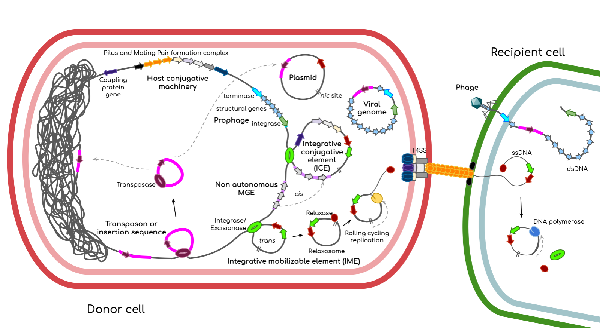

[](https://github.com/EBI-Metagenomics/mobilome-annotation-pipeline/actions/workflows/test_modules.yml)

# Mobilome Annotation Pipeline (former MoMofy)

<p align="center" width="100%">
   
</p>

Bacteria can acquire genetic material through horizontal gene transfer, allowing them to rapidly adapt to changing environmental conditions. These mobile genetic elements can be classified into three main categories: plasmids, phages, and integrative elements. Plasmids are mostly extrachromosmal; phages can be found extrachromosmal or as temperate phages (prophages); whereas integrons are stable inserted in the chromosome. Autonomous elements are those integrative elements capable of excising themselves from the chromosome and reintegrate elsewhere. They can use a transposase (like insertion sequences and transposons) or an integrase/excisionase (like ICEs and IMEs).

The Mobilome Annotation Pipeline is a wrapper that integrates the output of different tools designed for the prediction of plasmids, phages, insertion sequences, integrative mobile genetic elements such as ICEs, IMEs, integrons, and non-autonomous mobile genetic elements in prokaryotic genomes and metagenomes. The output is a GFF3 file with genes and mobilome annotation.

## Contents

- [ Workflow ](#wf)
- [ Setup ](#sp)
- [ Install and dependencies ](#install)
- [ Usage ](#usage)
- [ Inputs ](#in)
- [ Outputs ](#out)
- [ Tests ](#test)
- [ License and Attribution ](#license)
- [ Citation ](#cite)

<a name="wf"></a>

## Workflow

<p align="center" width="100%">
   
</p>

This workflow has the following main subworkflows:

- Preprocessing: Rename and filter contigs, and run PROKKA annotation.
- Prediction: Run geNomad, ICEfinder, IntegronFinder, ISEScan, and a compositional outliers detection module.
- Annotation: Generate extra-annotation for antimicrobial resistance genes (AMRFinderPlus) and other mobilome-related proteins (MobileOG).
- Integration: Parse and integrate the outputs generated on `Prediction` and `Annotation` subworkflows. In this step optional results of VIRify v3.0.0 can be incorporated. MGEs <500 bp lengh and predictions with no genes are discarded.
- Postprocessing: Write the mobilome fasta file, write a report of the location of AMR genes (either mobilome or chromosome), and generate three new GFF files:

1. `mobilome_clean.gff`: mobilome + associated CDSs
2. `mobilome_extra.gff`: mobilome + ViPhOGs/mobileOG annotated genes (note that ViPhOG annotation is generated by VIRify)
3. `mobilome_nogenes.gff`: mobilome only
   The output `mobilome_nogenes.gff` is validated in this subworkflow.

<a name="sp"></a>

## Setup

The only prerequisites for running it are [Nextflow](https://www.nextflow.io/) and a container tool such as [Docker](https://www.docker.com/) or [Singularity](https://docs.sylabs.io/guides/3.5/user-guide/introduction.html), since all tools use pre-built containers.

<a name="install"></a>

## Install and downloading dependencies

To get a copy of the Mobilome Annotation Pipeline, clone this repo by:

```bash
$ git clone https://github.com/EBI-Metagenomics/mobilome-annotation-pipeline.git
```

The first time you run the pipeline you will need to set up the following databases:

1. Download and index the database for AMRFinderPlus v3.12.8. To format the database you need to install the tool first following the instructions provided by the [AMRFinderPlus developers](https://github.com/ncbi/amr/wiki/Installing-AMRFinder#how-to-install)
```bash
wget -r -nH --cut-dirs=5 ftp://ftp.ncbi.nlm.nih.gov/pathogen/Antimicrobial_resistance/AMRFinderPlus/database/3.12/2024-01-31.1/
amrfinder_index 2024-01-31.1
```

2. Download and extract the geNomad database
```bash
wget https://zenodo.org/records/14886553/files/genomad_db_v1.9.tar.gz
tar -xvf genomad_db_v1.9.tar.gz
```

3. Download and extract the databases to run ICEfinder2-lite
```bash
wget https://ftp.ebi.ac.uk/pub/databases/metagenomics/pipelines/tool-dbs/icefinder2lite/icf2_dbs.tar.gz
tar -xvf icf2_dbs.tar.gz
```

Once the downloading is complete, you can move the files to any suitable location. Then you should pass the paths to all your datbases to the pipeline as a parameter during execution using the corresponding flag. For instance:

```bash
nextflow run /PATH/mobilome-annotation-pipeline/main.nf --input samplesheet.csv --genomad_db /FULL/PATH/TO/genomad_db_v1.9
```

Alternatively, we recomment to create a config file with the following paths and pass it to the pipeline during execution using `-c my_paths.config`

`my_paths.config`
```bash
/*
    ~~~~~~~~~~~~~~~~~~~~~~~~~~~~~~~~~~~~~~~~~~~~~
     Config to store my DB paths and names
    ~~~~~~~~~~~~~~~~~~~~~~~~~~~~~~~~~~~~~~~~~~~~~
*/

params {
    amrfinder_plus_db            = "/FULL/PATH/TO/2023-02-23.1"
    genomad_db                   = "/FULL/PATH/TO/genomad_db_v1.9"
    icefinder_macsyfinder_models = "/FULL/PATH/TO/icf2_dbs/macsydata/"
    icefinder_hmm_models         = "/FULL/PATH/TO/icf2_dbs/icehmm/icescan.hmm"
    icefinder_prokka_uniprot_db  = "/FULL/PATH/TO/icf2_dbs/icefinder_prokka_uniprot/prokka_uniprot_sprot.fasta"
}
```

<a name="usage"></a>

## Inputs

To run the Mobilome Annotation Pipeline on multiple samples, prepare a samplesheet with your input data that looks like the following example. Note that `virify_gff` is an optional input for this pipeline generated with the [VIRify](https://github.com/EBI-Metagenomics/emg-viral-pipeline) v3.0.0 tool.

`samplesheet.csv`:

```csv
sample,assembly,user_proteins_gff,virify_gff
minimal,/PATH/assembly.fasta,,
assembly_proteins,/PATH/assembly.fasta,/PATH/proteins.gff,
assembly_proteins_virify,/PATH/assembly.fasta,/PATH/proteins.gff,/PATH/virify_out.gff
```

Each row represents a sample. Note that sample names have to be unique. The minimal input is the (meta)genome assembly in fasta format.

Basic run:

```bash
$ nextflow run /PATH/mobilome-annotation-pipeline/main.nf --input samplesheet.csv
```

Note that the final output in GFF format is created by adding information to PROKKA output. If you have your own protein prediction files, provide the path to the uncompressed GFF file in the samplesheet.csv. This file will be used to generate a `user_mobilome_extra.gff` file containing the mobilome plus any extra annotation generated in the annotation subworkflow.

If you want to integrate VIRify results into the final output, provide the path to the GFF file generated by VIRify v3.0.0 in your samplesheet.csv.

<a name="out"></a>

## Outputs

Results will be written by default in the `results` directory unless the `--outdir` option is used. There, you will find the following outputs:

```bash
sample/
├── sample_discarded_mge.txt
├── sample_mobilome.fasta
├── sample_mobilome_prokka.gff
├── sample_overlap_report.txt
├── functional_annotation
│   ├── sample_amrfinderplus.tsv
│   ├── sample_amr_location.tsv
│   ├── sample_mobileog_hits.tsv
│   └── prokka_results
│       ├── sample.faa
│       ├── sample.fna
│       ├── sample.gbk
│       └── sample.gff
├── gff
│   ├── sample_mobilome_clean.gff
│   ├── sample_mobilome_extra.gff
│   ├── sample_mobilome_nogenes.gff
│   ├── sample_user_mobilome_clean.gff
│   ├── sample_user_mobilome_extra.gff
│   └── sample_user_mobilome_full.gff
├── prediction
│   ├── genomad
│   │   └── 5kb_contigs_summary
│   │       ├── 5kb_contigs_plasmid_summary.tsv
│   │       └── 5kb_contigs_virus_summary.tsv
│   ├── icefinder
│   │   ├── input.list
│   │   └── result
│   │       ├── icf_concat.summary
│   │       └── icf_dr.txt
│   ├── integronfinder
│   │   └── Results_Integron_Finder_sample_5kb_contigs
│   │       ├── 5kb_contigs.summary
│   │       ├── contig_1.gbk
│   │       ├── contig_5.gbk
│   │       ├── contig_6.gbk
│   │       └── contig_7.gbk
│   ├── isescan
│   │   └── sample_1kb_contigs.fasta.tsv
│   ├── virify_filter
│   │   └── sample_virify_hq.gff
│   └── compositional_outliers
│       └── sample.merged.bed
└── preprocessing
    ├── sample_1kb_contigs.fasta
    ├── sample_5kb_contigs.fasta
    └── sample_contigID.map
```

If `--publish_all` option is set to FALSE (default is TRUE), the output directory structure will look like:

```bash
sample/
├── sample_discarded_mge.txt
├── sample_mobilome.fasta
├── sample_mobilome_prokka.gff
├── sample_overlap_report.txt
├── functional_annotation
│   └── sample_amr_location.tsv
└── gff
    ├── sample_mobilome_clean.gff
    ├── sample_mobilome_extra.gff
    ├── sample_mobilome_nogenes.gff
    ├── sample_user_mobilome_clean.gff
    ├── sample_user_mobilome_extra.gff
    └── sample_user_mobilome_full.gff
```

The AMRFinderPlus results are generated by default. The `functional_annotation/amr_location.txt` file contains a summary of the AMR genes annotated and their location (either mobilome or chromosome).

The file `discarded_mge.txt` contains a list of predictions that were discarded, along with the reason for their exclusion. Possible reasons include:

1. 'mge < 500bp' - Discarded by length.
2. 'no_cds' - If there are no genes encoded in the prediction.

The file `overlap_report.txt` is a report of long-MGEs with overlapping coordinates. No predictions are discarded in this case.

The main output files containing the mobilome predictions are `mobilome.fasta` containing the nucleotide sequences of every prediction, and `mobilome_prokka.gff` containing the mobilome annotation plus any other feature annotated by PROKKA, mobileOG, or ViPhOG (only when VIRify results are provided).

The mobilome prediction IDs are built as follows:

1. Contig ID
2. MGE type:
   flanking_site
   recombination_site
   prophage
   viral_sequence
   plasmid
   phage_plasmid
   integron
   conjugative_integron
   insertion_sequence
   compositional_outlier
3. Start and end coordinates separated by ':'

Example:

```bash
>contig_id|mge_type-start:end
```

Any CDS with a coverage >= 0.9 in the boundaries of a predicted MGE is considered as part of the mobilome and labelled accordingly in the attributes field under the key `location`.

The labels used in the Type column of the GFF file correspond to the following nomenclature according to the [Sequence Ontology resource](http://www.sequenceontology.org/browser/current_svn/term/SO:0000001) when possible:

| Type in gff file        | Sequence ontology ID                                                              | Element description                                                         | Reporting tool            |
| ----------------------- | --------------------------------------------------------------------------------- | --------------------------------------------------------------------------- | ------------------------- |
| insertion_sequence      | [SO:0000973](http://www.sequenceontology.org/browser/current_svn/term/SO:0000973) | Insertion sequence                                                          | ISEScan                   |
| inverted_repeat_element | [SO:0000481](http://www.sequenceontology.org/browser/current_svn/term/SO:0000481) | Inverted Repeat (IR) flanking insertion sequences or compositional outliers | ISEScan, MAP              |
| integron                | [SO:0000365](http://www.sequenceontology.org/browser/current_svn/term/SO:0000365) | Integrative mobilizable element                                             | IntegronFinder, ICEfinder |
| attC_site               | [SO:0000950](http://www.sequenceontology.org/browser/current_svn/term/SO:0000950) | Integration site of DNA integron                                            | IntegronFinder            |
| conjugative_integron    | [SO:0000371](http://www.sequenceontology.org/browser/current_svn/term/SO:0000371) | Integrative Conjugative Element                                             | ICEfinder                 |
| direct_repeat           | [SO:0000314](http://www.sequenceontology.org/browser/current_svn/term/SO:0000314) | Flanking regions on mobilizable elements                                    | ICEfinder, MAP            |
| prophage                | [SO:0001006](http://www.sequenceontology.org/browser/current_svn/term/SO:0001006) | Temperate phage                                                             | geNomad, VIRify           |
| viral_sequence          | [SO:0001041](http://www.sequenceontology.org/browser/current_svn/term/SO:0001041) | Viral genome fragment                                                       | geNomad, VIRify           |
| plasmid                 | [SO:0000155](http://www.sequenceontology.org/browser/current_svn/term/SO:0000155) | Plasmid                                                                     | geNomad                   |

Label `compositional_outlier` corresponds to non-autonomous elements detected by MAP in contigs > 100 kb long.

<a name="test"></a>

## Tests

Nextflow tests are executed with [nf-test](https://github.com/askimed/nf-test). It takes around 3 min to execute.

Run:

```bash
$ cd mobilome-annotation-pipeline/
$ nf-test test
```

## Development Tasks

This project uses [Task](https://taskfile.dev/) to manage common development tasks and [uv](https://docs.astral.sh/uv/) for Python virtual environment management. The available tasks are:

```bash
# Setup and dependencies
$ task setup-venv          # Bootstrap Python virtual environment with uv and install dependencies

# Testing
$ task test                # Run all tests with pytest
$ task test-verbose        # Run tests with verbose output
$ task test-coverage       # Run tests with coverage report (generates HTML report)
$ task test-specific -- <pattern>  # Run specific test file or pattern

# Utilities
$ task clean               # Clean up virtual environment
```

To see all available tasks, run:

```bash
$ task --list
```

<a name="license"></a>

## License and Attribution

### ICEfinder2 Attribution

This pipeline includes scripts derived from or inspired by ICEfinder2 algorithms and methods. The following scripts contain code adapted from ICEfinder2:

- `bin/ice_boundary_refinement.py` - ICE boundary refinement and direct repeat processing
- `bin/map_tools/icefinder_process.py` - ICE result processing and data formatting
- `bin/prescan_to_fasta.py` - ICE prescanning and candidate detection methods

**ICEfinder2 License**: These algorithms are used under the Creative Commons Attribution-NonCommercial-ShareAlike 4.0 International License (CC BY-NC-SA 4.0).

- Original work: ICEfinder2 (http://creativecommons.org/licenses/by-nc-sa/4.0/)
- Modifications: Licensed under Apache 2.0 by EMBL-EBI

<a name="cite"></a>

## Citation

The Mobilome Annotation Pipeline parses and integrates the output of the following tools and DBs sorted alphabetically:

- AMRFinderPlus v3.11.4 with database v2023-02-23.1 [Feldgarden et al., Sci Rep, 2021](https://doi.org/10.1038/s41598-021-91456-0)
- Diamond v2.0.12 [Buchfink et al., Nature Methods, 2021](https://doi.org/10.1038/s41592-021-01101-x)
- geNomad v1.11.1 [Camargo et al., Nature Biotechnology, 2023](https://doi.org/10.1038/s41587-023-01953-y)
- ICEfinder v2.0 [Wang et al., Nucleic Acids Res, 2024](https://academic.oup.com/nar/article/52/D1/D732/7327075)
- IntegronFinder2 v2.0.6 [Néron et al., Microorganisms, 2022](https://doi.org/10.3390/microorganisms10040700)
- ISEScan v1.7.3 [Xie et al., Bioinformatics, 2017](https://doi.org/10.1093/bioinformatics/btx433)
- MobileOG-DB Beatrix 1.6 v1 [Brown et al., Appl Environ Microbiol, 2022](https://doi.org/10.1128/aem.00991-22)
- PROKKA v1.14.6 [Seemann, Bioinformatics, 2014](https://doi.org/10.1093/bioinformatics/btu153)
- VIRify v3.0.0 [Rangel-Pineros et al., PLoS Comput Biol, 2023](https://doi.org/10.1371/journal.pcbi.1011422)
